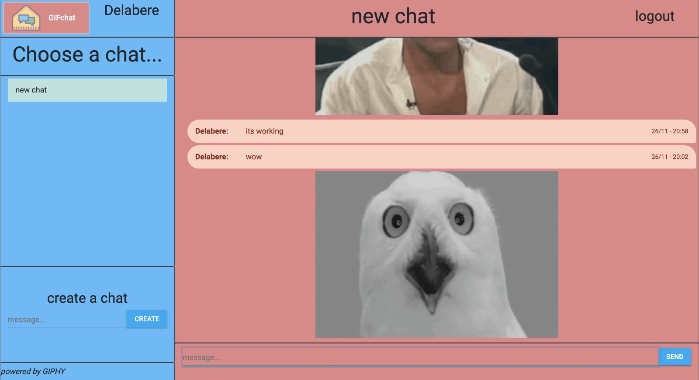

# Gif-Chat

Gif-Chat is a chat application running on a flask backend. It uses websockets and API calls to the backend to update the chat in real time amongst multiple users.

I hope that it proves fun. http://209.97.176.130/



# application.py
This file contains the view functions for login and chat pages

# templates
This folder contains .html template files for the login and chat pages

# static
This folder contains css and javascript code for the project

# data.json
This is the file which stores message data including gif url endpoints

# requirements.txt
run
"pip install -r requirements.txt"
to install all project requirements.

# running the app
run
```
python app.py
```
